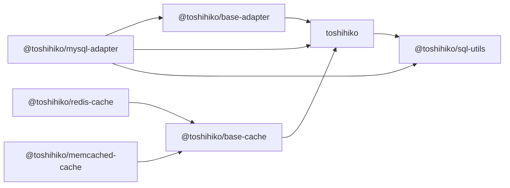

<div align="center">
  
  <h1>Toshihiko</h1>
  <p>Yet another simple ORM for Node.js.</p>
  <p>
    <a href="https://github.com/toshihikojs/Toshihiko/actions/workflows/ci.yml"></a>
    <a href="https://nodejs.org/"></a>
    <a href="LICENSE"></a>
  </p>
</div>

Toshihiko is deliberately simple. It maps rows to models, builds predictable queries, and stays out of database design. It does not try to manage foreign keys, table relationships, schema creation, or schema migrations. Create and evolve your tables explicitly; use Toshihiko for the CRUD work around them.

Version 2 carries that original philosophy into a TypeScript codebase. It keeps the familiar `Toshihiko.define()` model API, derives types directly from schemas, and uses native Promises throughout its extension points.

> **Project status:** Toshihiko v2 is under active development. The current packages use prerelease versions and require Node.js 22 or newer.

## Why Toshihiko?

- **Deliberately narrow scope.** Toshihiko is an ORM, not a schema manager, migration framework, or relationship graph.
- **Schema-derived TypeScript types.** Model rows, query fields, primary keys, defaults, and custom field values are inferred directly from `define()`.
- **Promise APIs.** Queries, adapters, validators, writes, and transactions use native Promises.
- **The original model API.** Existing concepts such as Model, Query, Yukari, field types, `where()`, `find()`, and `findById()` remain recognizable.
- **Explicit adapter boundaries.** Database-specific connections and result types stay inside adapter packages instead of leaking into the ORM core.
- **Real compatibility tests.** GitHub Actions covers Node.js 22 and 24, with service-backed tests for MySQL 5.7 and 8.4, Redis, and Memcached.

## Quick start

Install the core and the MySQL adapter:

```bash
npm install toshihiko @toshihiko/mysql-adapter
```

Define a model using the original Toshihiko API:

```typescript
import { Toshihiko, Type } from 'toshihiko';

const database = new Toshihiko('mysql', {
  database: 'app',
  host: '127.0.0.1',
  password: 'secret',
  username: 'root',
});

const User = database.define('users', [
  {
    name: 'id',
    column: 'user_id',
    type: Type.Integer,
    primaryKey: true,
    autoIncrement: true,
  },
  {
    name: 'name',
    type: Type.String,
  },
]);

const user = User.build({
  name: 'Alice',
});

await user.insert();

const persistedUser = await User.findById(user.id);
if (persistedUser) {
  persistedUser.name = 'Updated Alice';
  await persistedUser.save();
}

const users = await User
  .where({ id: { $gte: 1 }, name: { $like: 'A%' } })
  .orderBy({ id: 'desc' })
  .limit(10)
  .find(true);

const userCount = await User.where({ name: { $like: 'A%' } }).count();

await persistedUser?.delete();
```

`build()` returns a typed Yukari instance, so Toshihiko infers `id` as `number`, `name` as `string`, and the primary key as `id` directly from the schema without requiring a separately maintained row interface or type alias. `insert()` validates the Yukari, persists it through the configured Adapter, and hydrates database-generated values back into the same instance. As in v1, an inserted Yukari remains a new row; query it before updating or deleting it. `update()` validates queried data and writes changed fields using the original primary key. `save()` inserts new rows and updates queried rows, while `delete()` removes a queried row using its original primary key.

## Packages

Toshihiko is developed as a monorepo, but each package keeps an independent public API and release boundary.

| Package | Coverage | Directory | Purpose |
|---|---|---|---|
| [`toshihiko`](packages/toshihiko) | [](https://toshihikojs.github.io/Toshihiko/coverage/toshihiko/) | `packages/toshihiko` | ORM core, Model, Query, Yukari, and built-in field types |
| [`@toshihiko/base-adapter`](packages/base-adapter) | [](https://toshihikojs.github.io/Toshihiko/coverage/base-adapter/) | `packages/base-adapter` | Typed, Promise-only foundation for adapter authors; installed transitively by concrete adapters |
| [`@toshihiko/mysql-adapter`](packages/mysql-adapter) | [](https://toshihikojs.github.io/Toshihiko/coverage/mysql-adapter/) | `packages/mysql-adapter` | MySQL adapter built on the `mysql2` Promise API |
| [`@toshihiko/base-cache`](packages/base-cache) | [](https://toshihikojs.github.io/Toshihiko/coverage/base-cache/) | `packages/base-cache` | Typed, Promise-only foundation for cache implementations |
| [`@toshihiko/redis-cache`](packages/redis) | [](https://toshihikojs.github.io/Toshihiko/coverage/redis-cache/) | `packages/redis` | Redis cache preserving the v1 key and result behavior |
| [`@toshihiko/memcached-cache`](packages/memcached) | [](https://toshihikojs.github.io/Toshihiko/coverage/memcached-cache/) | `packages/memcached` | Memcached cache preserving v1 batching and custom keys |
| [`@toshihiko/sql-utils`](packages/sql-utils) | [](https://toshihikojs.github.io/Toshihiko/coverage/sql-utils/) | `packages/sql-utils` | SQL identifier mapping and escaping utilities |

The dependency direction is intentionally small:



## Type inference

Built-in and custom field types flow through the complete model API:

```typescript
const Article = database.define('articles', [
  { name: 'id', type: Type.Integer, primaryKey: true },
  { name: 'title', type: Type.String },
  { name: 'publishedAt', type: Type.Datetime, allowNull: true },
  { name: 'metadata', type: Type.Json },
]);

const article = Article.build({
  id: 1,
  title: 'Typed models without duplicate interfaces',
  publishedAt: null,
  metadata: { language: 'en' },
});

article.title = 'Types inferred directly from build()';
await article.validateAll();

await Article.findById(1);

// Query fields and primary-key values use the same inferred schema.
Article.where({ title: { $like: 'Typed%' } });
```

`Model.build()` returns a Yukari instance whose known and optional properties reflect the supplied input and schema defaults. Asynchronous validators can then run through `validateAll()`.

## Documentation

The v2 guide follows the original 1.x documentation structure while describing the current TypeScript and Promise APIs:

- [Getting started](docs/getting-started.md)
- [Model definition](docs/model/definition.md)
- [Model usage](docs/model/usage.md)
- [Querying](docs/querying.md)
- [Yukari instances](docs/yukari.md)
- [Data types](docs/types.md)
- [Testing](docs/testing.md)

## Adapter model

The core depends on a small Promise-based adapter contract. Concrete adapters own their connection, query, field, and mutation result types. The v1 dialect name remains available when the corresponding package is installed:

```typescript
const database = new Toshihiko('mysql', {
  database: 'app',
});
```

Adapter constructors and instances can also be injected directly. Toshihiko calls a constructor with the v1 `(toshihiko, options)` arguments; `@toshihiko/base-adapter` and `@toshihiko/mysql-adapter` also retain standalone `new Adapter(options)` construction.

```typescript
import { MySQLAdapter } from '@toshihiko/mysql-adapter';

const injectedDatabase = new Toshihiko(MySQLAdapter, {
  database: 'app',
});
```

The MySQL Adapter uses `mysql2` prepared execution for bound values and preserves the original Toshihiko query operators for migration compatibility.

## Caching

Redis and Memcached cache implementations are developed and released from this monorepo. Cache instances can be configured globally and inherited by Models, overridden for one Model, or disabled with `cache: false`. The MySQL cache path is regression-tested with Memcached; the Redis package separately preserves its v1 positional `null` miss results.

```typescript
import { MemcachedCache } from '@toshihiko/memcached-cache';

const cache = new MemcachedCache('127.0.0.1:11211', {
  prefix: 'app:',
});

const cachedDatabase = new Toshihiko('mysql', {
  cache,
  database: 'app',
});
```

Queries read and fill the configured cache using the original Toshihiko key flow. Updates and deletes invalidate matching primary-key entries before the database mutation. Pass `{ noCache: true }` to `find()` to bypass cache reads for one query.

## Development

### Requirements

- Node.js 22 or 24
- npm
- [Rush](https://rushjs.io/) 5.172.1

Install the development tools once:

```bash
npm install --global @microsoft/rush@5.172.1
```

Install all workspace dependencies through Rush's npm integration:

```bash
rush update
```

Rush downloads the pinned official npm version declared in `rush.json`, then manages installation, the project graph, build order, tests, version policies, and releases.

```bash
rush check
rush build
rush typecheck
rush test
```

Run a command for a specific package and its dependencies:

```bash
rush build --to @toshihiko/mysql-adapter
rush test --to @toshihiko/mysql-adapter
```

## Testing

Unit and package-contract tests run locally without external services:

```bash
rush build
rush test
```

Service-backed tests run in GitHub Actions against MySQL 5.7 and MySQL 8.4 together with Redis and Memcached. Local development does not require Docker. If you already have compatible services, run the integration suite explicitly:

```bash
MYSQL_DATABASE=toshihiko_test \
MYSQL_HOST=127.0.0.1 \
MYSQL_PASSWORD=toshihiko \
MYSQL_PORT=3306 \
MYSQL_USER=root \
REDIS_HOST=127.0.0.1 \
REDIS_PORT=6379 \
MEMCACHED_HOST=127.0.0.1 \
MEMCACHED_PORT=11211 \
rush test:integration
```

## Versioning and releases

Rush tracks changes and publishes packages independently:

- `toshihiko`, `@toshihiko/base-adapter`, `@toshihiko/mysql-adapter`, `@toshihiko/base-cache`, `@toshihiko/redis-cache`, and `@toshihiko/memcached-cache` are locked to major version 2, but do not need to publish together.
- `@toshihiko/sql-utils` remains on its independent 1.x version line.
- A change to an adapter does not force an unrelated core release.

Contributors should add a Rush change file for user-visible package changes:

```bash
rush change
```

## Contributing

Issues and pull requests are welcome. Before opening a pull request:

1. Install dependencies with `rush update`.
2. Run `rush check`, `rush build`, `rush typecheck`, and `rush test`.
3. Add or update tests for behavioral changes.
4. Add a Rush change file when the change affects a published package.

Please keep public API compatibility intentional. Toshihiko v2 preserves the original model vocabulary and `define()` shape within its Promise architecture.

## About the name

Toshihiko is a character from [Touhou Warring States Nights](https://tieba.baidu.com/p/1386358409), a collaborative Touhou fan work. The name has been part of the project since its first release in 2014.

## Acknowledgements

Toshihiko exists thanks to its maintainers, contributors, and users. Special thanks to the contributors highlighted by the original project:

- [@luicfer](https://github.com/luicfer)
- [@mapleincode](https://github.com/mapleincode)
- [@plusmancn](https://github.com/plusmancn)

## License

[MIT](LICENSE)
