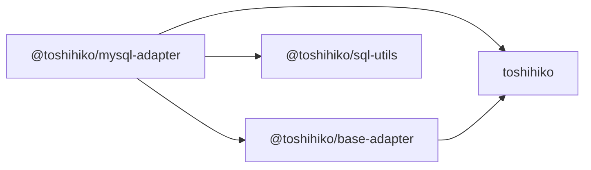

# Toshihiko

[](https://github.com/toshihikojs/Toshihiko/actions/workflows/ci.yml)
[](https://nodejs.org/)
[](LICENSE)

Yet another simple ORM for Node.js.

Toshihiko is deliberately simple. It maps rows to models, builds predictable queries, and stays out of database design. It does not try to manage foreign keys, table relationships, schema creation, or schema migrations. Create and evolve your tables explicitly; use Toshihiko for the CRUD work around them.

Version 2 carries that original philosophy into a TypeScript codebase. It keeps the familiar `Toshihiko.define()` model API, derives types directly from schemas, and replaces callback-based extension points with native Promises.

> **Project status:** Toshihiko v2 is under active development. The current packages use prerelease versions and require Node.js 22 or newer.

## Why Toshihiko?

- **Deliberately narrow scope.** Toshihiko is an ORM, not a schema manager, migration framework, or relationship graph.
- **Schema-derived TypeScript types.** Model rows, query fields, primary keys, defaults, and custom field values are inferred directly from `define()`.
- **No `as const` requirement.** Define a schema with an ordinary array literal and retain field-level inference.
- **Promise-only APIs.** Queries, adapters, validators, writes, and transactions use native Promises; v2 does not provide callback overloads.
- **The original model API.** Existing concepts such as Model, Query, Yukari, field types, `where()`, `find()`, and `findById()` remain recognizable.
- **Explicit adapter boundaries.** Database-specific connections and result types stay inside adapter packages instead of leaking into the ORM core.
- **Real compatibility tests.** GitHub Actions covers Node.js 22 and 24, plus MySQL 5.7 and 8.4 integration jobs.

## Quick start

Install the core and the MySQL adapter:

```bash
npm install toshihiko @toshihiko/mysql-adapter
```

Define a model using the original Toshihiko API:

```typescript
import { MySQLAdapter } from '@toshihiko/mysql-adapter';
import { Toshihiko, Type } from 'toshihiko';

const database = new Toshihiko(MySQLAdapter, {
  database: 'app',
  host: '127.0.0.1',
  password: 'secret',
  username: 'root',
});

const User = database.define('users', [
  {
    name: 'id',
    column: 'user_id',
    type: Type.Integer,
    primaryKey: true,
    autoIncrement: true,
  },
  {
    name: 'name',
    type: Type.String,
  },
]);

const user = User.build({
  name: 'Alice',
});

await user.validateAll();

const users = await User
  .where({ id: { $gte: 1 }, name: { $like: 'A%' } })
  .orderBy({ id: 'desc' })
  .limit(10)
  .find(true);
```

The schema is an ordinary array literal. `build()` returns a typed Yukari instance, so Toshihiko infers `id` as `number`, `name` as `string`, and the primary key as `id` without requiring a separately maintained row interface or type alias.

## Packages

Toshihiko is developed as a monorepo, but each package keeps an independent public API and release boundary.

| Package | Directory | Purpose |
|---|---|---|
| [`toshihiko`](packages/toshihiko) | `packages/toshihiko` | ORM core, Model, Query, Yukari, and built-in field types |
| [`@toshihiko/base-adapter`](packages/base-adapter) | `packages/base-adapter` | Typed, Promise-only foundation for adapter authors; installed transitively by concrete adapters |
| [`@toshihiko/mysql-adapter`](packages/mysql-adapter) | `packages/mysql-adapter` | MySQL adapter built on the `mysql2` Promise API |
| [`@toshihiko/sql-utils`](packages/sql-utils) | `packages/sql-utils` | SQL identifier mapping and escaping utilities |

The dependency direction is intentionally small:



## Type inference

Built-in and custom field types flow through the complete model API:

```typescript
const Article = database.define('articles', [
  { name: 'id', type: Type.Integer, primaryKey: true },
  { name: 'title', type: Type.String },
  { name: 'publishedAt', type: Type.Datetime, allowNull: true },
  { name: 'metadata', type: Type.Json },
]);

const article = Article.build({
  id: 1,
  title: 'Typed models without duplicate interfaces',
  publishedAt: null,
  metadata: { language: 'en' },
});

article.title = 'Types inferred directly from build()';
await article.validateAll();

await Article.findById(1);

// Query fields and primary-key values use the same inferred schema.
Article.where({ title: { $like: 'Typed%' } });
```

`Model.build()` returns a Yukari instance whose known and optional properties reflect the supplied input and schema defaults. Asynchronous validators can then run through `validateAll()`.

## Adapter model

The core depends on a small Promise-based adapter contract. Concrete adapters own their connection, query, field, and mutation result types. An adapter constructor or instance can be passed directly to Toshihiko:

```typescript
const database = new Toshihiko(MySQLAdapter, {
  database: 'app',
});
```

No runtime package-name lookup is required. The MySQL adapter uses `mysql2` prepared execution for bound values and preserves the original Toshihiko query operators for migration compatibility.

## Development

### Requirements

- Node.js 22 or 24
- npm
- [Rush](https://rushjs.io/) 5.172.1

Install the development tools once:

```bash
npm install --global @microsoft/rush@5.172.1
```

Install all workspace dependencies through Rush's npm integration:

```bash
rush update
```

Rush downloads the pinned official npm version declared in `rush.json`, then manages installation, the project graph, build order, tests, version policies, and releases.

```bash
rush check
rush build
rush typecheck
rush test
```

Run a command for a specific package and its dependencies:

```bash
rush build --to @toshihiko/mysql-adapter
rush test --to @toshihiko/mysql-adapter
```

## Testing

Unit and package-contract tests run locally without external services:

```bash
rush build
rush test
```

MySQL integration tests run in GitHub Actions against MySQL 5.7 and MySQL 8.4. Local development does not require Docker. If you already have a compatible MySQL server, you can run the integration suite explicitly:

```bash
MYSQL_DATABASE=toshihiko_test \
MYSQL_HOST=127.0.0.1 \
MYSQL_PASSWORD=toshihiko \
MYSQL_PORT=3306 \
MYSQL_USER=root \
rush test:integration --to @toshihiko/mysql-adapter
```

## Versioning and releases

Rush tracks changes and publishes packages independently:

- `toshihiko`, `@toshihiko/base-adapter`, and `@toshihiko/mysql-adapter` are locked to major version 2, but do not need to publish together.
- `@toshihiko/sql-utils` remains on its independent 1.x version line.
- A change to an adapter does not force an unrelated core release.

Contributors should add a Rush change file for user-visible package changes:

```bash
rush change
```

## Contributing

Issues and pull requests are welcome. Before opening a pull request:

1. Install dependencies with `rush update`.
2. Run `rush check`, `rush build`, `rush typecheck`, and `rush test`.
3. Add or update tests for behavioral changes.
4. Add a Rush change file when the change affects a published package.

Please keep public API compatibility intentional. Toshihiko v2 removes callbacks, but it preserves the original model vocabulary and `define()` shape wherever the Promise-only architecture allows it.

## About the name

Toshihiko is a character from [Touhou Warring States Nights](https://tieba.baidu.com/p/1386358409), a collaborative Touhou fan work. The name has been part of the project since its first release in 2014.

## Acknowledgements

Toshihiko exists thanks to its maintainers, contributors, and users. Special thanks to the contributors highlighted by the original project:

- [@luicfer](https://github.com/luicfer)
- [@mapleincode](https://github.com/mapleincode)
- [@plusmancn](https://github.com/plusmancn)

## License

[MIT](LICENSE)
